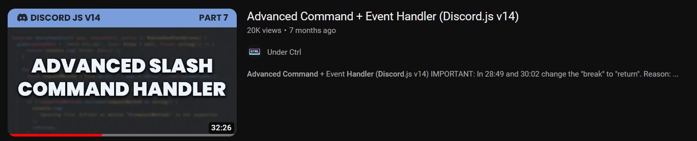
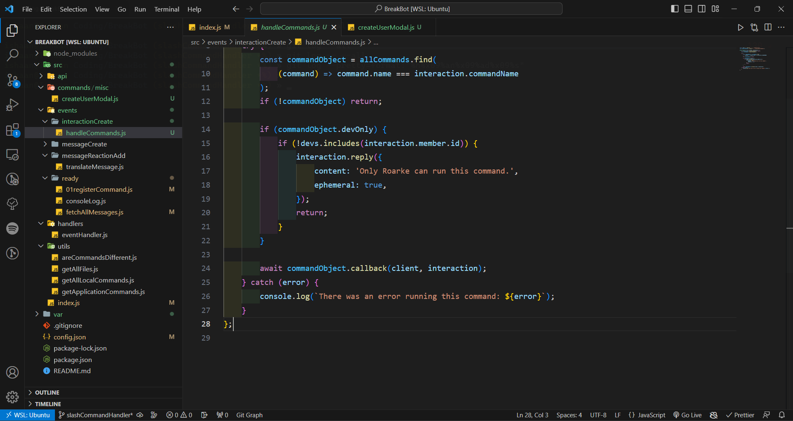
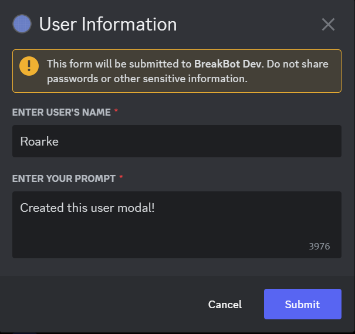

# 100 Days Of Code - Log

### Day 1: August 14, 2023

**Today's Progress**: Started working on my Discord bot and learned how to add slash commands.

**Thoughts**: I didn’t really code much on day one. I just spent time watching tutorials. It was terrible; I didn’t really learn much, I felt. But I knew I needed to learn before I started working on this project.”

### Day 2: August 15, 2023

**Today's Progress**: Implemented a commands handler on the bot, and also created a slash command.

**Thoughts**: Day two was very different from day one. I started coding early in the morning after going through tutorials and reading documentation. I actually coded a lot today. About a few hours before I exhausted my brain cells and had to call it a day, I implemented the slash commands and also a way to handle the commands for my Discord bot. I might need to go through it again in the future since I followed a tutorial mostly but I also tried to understand what was happening behind the scenes.

### Day 3: August 17, 2023

**Today's Progress**: Created a modal popup & setup MongoDB

**Thoughts**: The modal popup part was decent. I finished working on all of this at 4 am in the morning, but that’s because I procrastinated on this thing the whole day. I followed a tutorial to create the modal popup and customized it based on my requirements. I also set up MongoDB in my project using Mongoose.

